<h2>TensorFlow-FlexUNet-Image-Segmentation-MVTec-WOOD (2025/10/26)</h2>

Toshiyuki Arai 
Software Laboratory antillia.com 
 
This is the first experiment of Image Segmentation for <b>MVTec-WOOD </b> based on 
our <a href="./src/TensorFlowFlexUNet.py">TensorFlowFlexUNet</a>
 (<b>TensorFlow Flexible UNet Image Segmentation Model for Multiclass</b>)
, and a 512x512 pixels PNG dataset <a href="https://drive.google.com/file/d/1Lo59srJo4dVWZ5xriigwJaYpkml6FgWc/view?usp=sharing">
Augmented-MVTEC-WOOD-ImageMask-Dataset.zip</a> with colorized masks 
 which was derived by us from <b>wood</b> subset of 
<a href="https://www.mvtec.com/company/research/datasets/mvtec-ad">
<b>The MVTec anomaly detection dataset
</a>
</b>
 
 
<b>Data Augmentation Strategy</b> 
To address the limited size of images and masks of <b>wood</b> subset of the MVTec dataset, 
we used our offline augmentation tool <a href="https://github.com/sarah-antillia/ImageMask-Dataset-Offline-Augmentation-Tool"> 
ImageMask-Dataset-Offline-Augmentation-Tool</a> to augment the <b>wood</b> subset.
  

<b>Actual Image Segmentation for Images of 512x512 pixels</b> 
As shown below, the inferred masks predicted by our segmentation model trained on the 
PNG dataset appear similar to the ground truth masks, but they lack precision in certain areas. 
<b>rgb_map (color:blue, combined:red, hole:green, liquid:yellow,scratch:cyan)</b>  
 
<table>
<tr>
<th>Input: image</th>
<th>Mask (ground_truth)</th>
<th>Prediction: inferred_mask</th>
</tr>
<tr>
<td></td>
<td>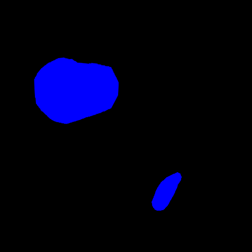</td>
<td></td>
</tr>
</tr>
<td></td>
<td></td>
<td>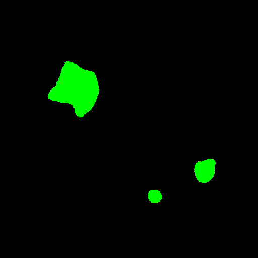</td>
</tr>
<tr>
<td>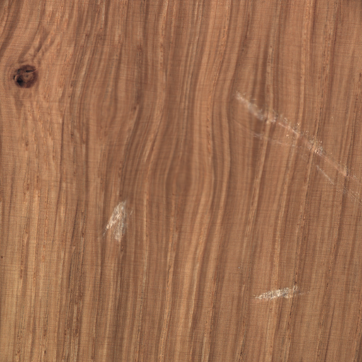</td>
<td>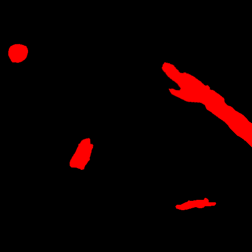</td>
<td>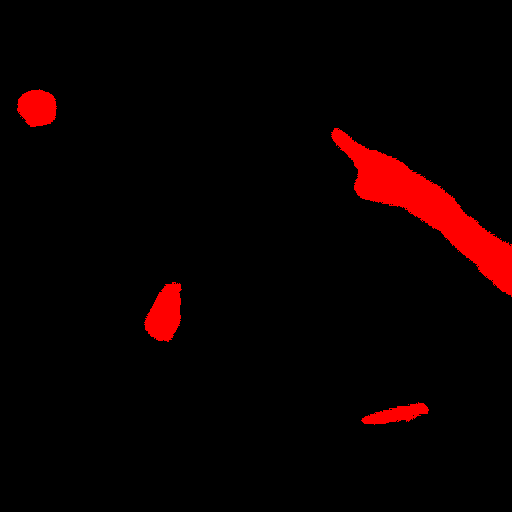</td>
</tr>
</table>

 
<h3>1 Dataset Citation</h3>
The dataset used here was obtained from 
  
<a href="https://www.mvtec.com/company/research/datasets/mvtec-ad">
<b>The MVTec anomaly detection dataset
</a>
</b>
 
<h4>Citation</h4>
<b>If you use this dataset in scientific work, please cite our papers:</b> 
Paul Bergmann, Kilian Batzner, Michael Fauser, David Sattlegger, Carsten Steger:  
<b>The MVTec Anomaly Detection Dataset: A Comprehensive Real-World Dataset for Unsupervised Anomaly Detection;</b>  
in: International Journal of Computer Vision 129(4):1038-1059, 2021, 
 DOI: 10.1007/s11263-020-01400-4. 
 
Paul Bergmann, Michael Fauser, David Sattlegger, Carsten Steger:  
<b>MVTec AD — A Comprehensive Real-World Dataset for Unsupervised Anomaly Detection; </b>in:  
IEEE/CVF Conference on Computer Vision and Pattern Recognition (CVPR), 9584-9592, 2019,  
DOI: 10.1109/CVPR.2019.00982.
 
 
<h4>LICENSE</h4>
The data is released under 
<a href="https://creativecommons.org/licenses/by-nc-sa/4.0/">
the Creative Commons Attribution-NonCommercial-ShareAlike 4.0 International License (CC BY-NC-SA 4.0).
</a>
 
<b>You may not use the material for commercial purposes.</b></a>
 
 
<h3>
2 MVTEC-WOOD ImageMask Dataset
</h3>
<h3>2.1 ImageMask Dataset</h3>
 If you would like to train this MVTEC-WOOD Segmentation model by yourself,
 please download our data <a href="https://drive.google.com/file/d/1Lo59srJo4dVWZ5xriigwJaYpkml6FgWc/view?usp=sharing">
 Augmented-MVTEC-WOOD-ImageMask-Dataset.zip
 </a> on the google drive,
, expand the downloaded, and put it under dataset folder to be:
<pre>
./dataset
└─MVTEC-WOOD
    ├─test
    │   ├─images
    │   └─masks
    ├─train
    │   ├─images
    │   └─masks
    └─valid
        ├─images
        └─masks
</pre>
<b>MVTEC-WOOD Statistics</b> 
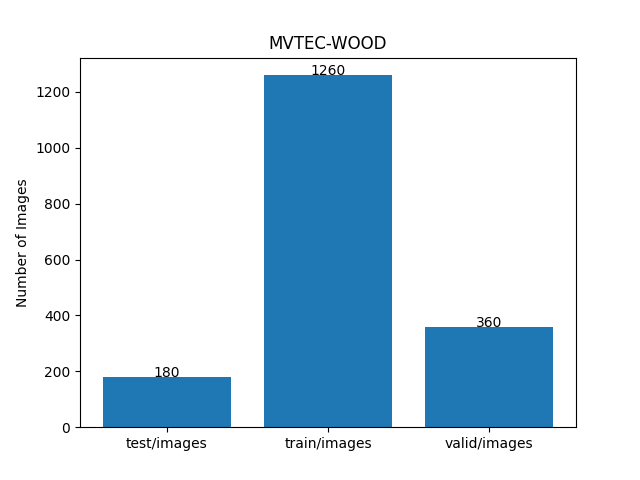 
 
As shown above, the number of images of train and valid datasets is not enough to use for a training set of our segmentation model.
  
<h3>2.2 ImageMask Dataset Generation</h3>
The folder structure of the original <b>mvtec_anomaly_detection</b> is the following. 
<pre>
./mvtec_anomaly_detection
├─bottle
├─cable
├─capsule
├─carpet
├─grid
├─hazelnut
├─leather
├─metal_nut
├─pill
├─screw
├─tile
├─toothbrush
├─transistor
├─wood
└─zipper
</pre>

For simplicity, we generated our Augmented MVTEC-WOOD dataset from masks in <b>ground_truth</b> 
and images in <b>test</b> folders of <b>tile</b> dataset. 
<pre>
./wood
├─ground_truth
│  ├─color
│  ├─combined
│  ├─hole
│  ├─liquid
│  └─scratch
├─test
│  ├─color
│  ├─combined
│  ├─good
│  ├─hole
│  ├─liquid
│  └─scratch
└─train
    └─good
</pre>    
 
 
<h3>2.3 Train Images and Masks Sample </h3>
<b>Train_images_sample</b> 

 
<b>Train_masks_sample</b> 
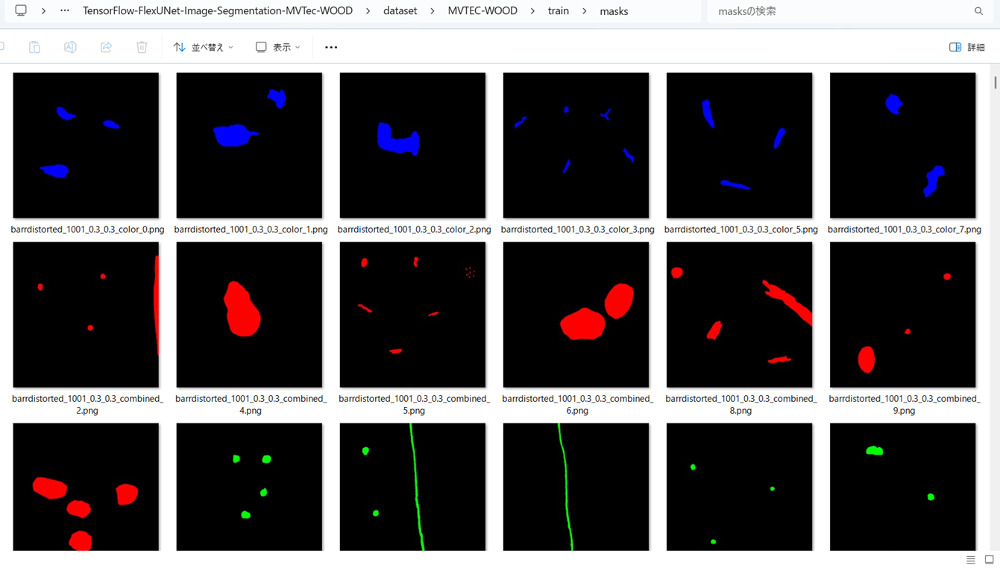
 
 
<h3>
3 Train TensorFlowFlexUNet Model
</h3>
 We trained MVTEC-WOOD TensorFlowFlexUNet Model by using 
<a href="./projects/TensorFlowFlexUNet/MVTEC-WOOD/train_eval_infer.config"> <b>train_eval_infer.config</b></a> file.  
Please move to ./projects/TensorFlowFlexUNet/MVTEC-WOOD, and run the following bat file. 
<pre>
>1.train.bat
</pre>
, which simply runs the following command. 
<pre>
>python ../../../src/TensorFlowFlexUNetTrainer.py ./train_eval_infer.config
</pre>

<b>Model parameters</b> 
Defined a small <b>base_filters = 16</b> and large <b>base_kernels = (9,9)</b> for the first Conv Layer of Encoder Block of 
<a href="./src/TensorFlowFlexUNet.py">TensorFlowFlexUNet.py</a> 
and a large num_layers (including a bridge between Encoder and Decoder Blocks).
<pre>
[model]
image_width    = 512
image_height   = 512
image_channels = 3

num_classes    = 6

base_filters   = 16
base_kernels   = (9,9)
num_layers     = 6
dropout_rate   = 0.04
dilation       = (1,1)

</pre>

<b>Learning rate</b> 
Defined a very small learning rate.  
<pre>
[model]
learning_rate  = 0.00007
</pre>

<b>Online augmentation</b> 
Disabled our online augmentation.  
<pre>
[model]
model         = "TensorFlowFlexUNet"
generator     = False
</pre>

<b>Loss and metrics functions</b> 
Specified "categorical_crossentropy" and <a href="./src/dice_coef_multiclass.py">"dice_coef_multiclass"</a>. 
You may specify other loss and metrics function names. 
<pre>
[model]
loss           = "categorical_crossentropy"
metrics        = ["dice_coef_multiclass"]
</pre>
<b>Learning rate reducer callback</b> 
Enabled learing_rate_reducer callback, and a small reducer_patience.
<pre> 
[train]
learning_rate_reducer = True
reducer_factor     = 0.4
reducer_patience   = 4
</pre>

<b>Early stopping callback</b> 
Enabled early stopping callback with patience parameter.
<pre>
[train]
patience      = 10
</pre>

<b>RGB Color map</b> 
rgb color map dict for MVTEC-WOOD 1+5 classes.
<pre>
[mask]
mask_datatype    = "categorized"
mask_file_format = ".png"
;                  color:blue,   combined:red, hole:green,    liquid:yellow, scratch:cyan 
rgb_map={(0,0,0):0,(0,0,255):1, (255,0,0):2, (0,255,0):3, (255,255, 0):4, (0,255,255):5, }

</pre>

<b>Epoch change inference callback</b> 
Enabled <a href="./src/EpochChangeInferencer.py">epoch_change_infer callback (EpochChangeInferencer.py)</a></b>. 
<pre>
[train]
epoch_change_infer       = True
epoch_change_infer_dir   =  "./epoch_change_infer"
num_infer_images         = 6
</pre>

By using this callback, on every epoch_change, the inference procedure can be called
 for 6 images in <b>mini_test</b> folder. This will help you confirm how the predicted mask changes 
 at each epoch during your training process.    

<b>Epoch_change_inference output at starting (epoch 1,2,3)</b> 
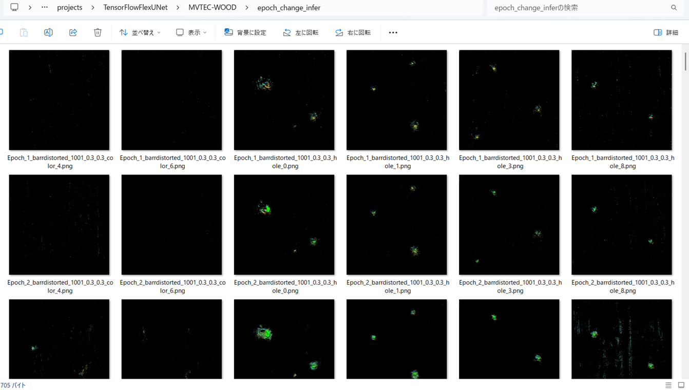 
 
<b>Epoch_change_inference output at middlepoint (epoch 22,23,24)</b> 
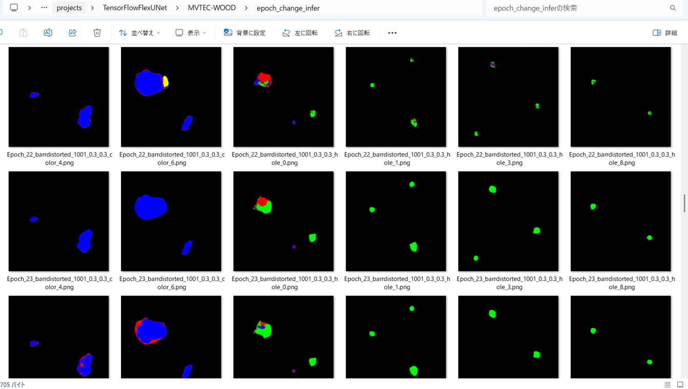 
 

<b>Epoch_change_inference output at ending (epoch 45,46,47)</b> 
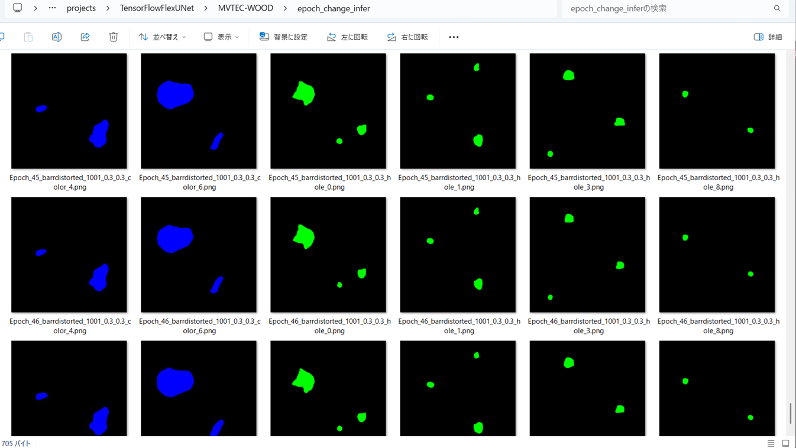 
 

In this experiment, the training process was stopped at epoch 47 by EarlyStopping Callback.  
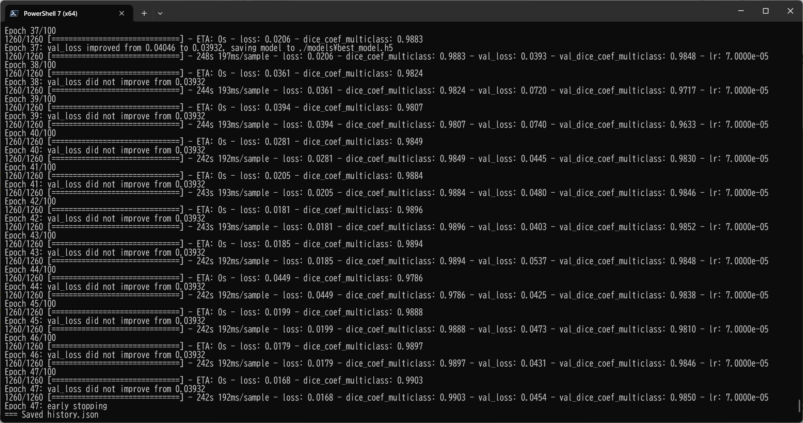 
 

<a href="./projects/TensorFlowFlexUNet/MVTEC-WOOD/eval/train_metrics.csv">train_metrics.csv</a> 
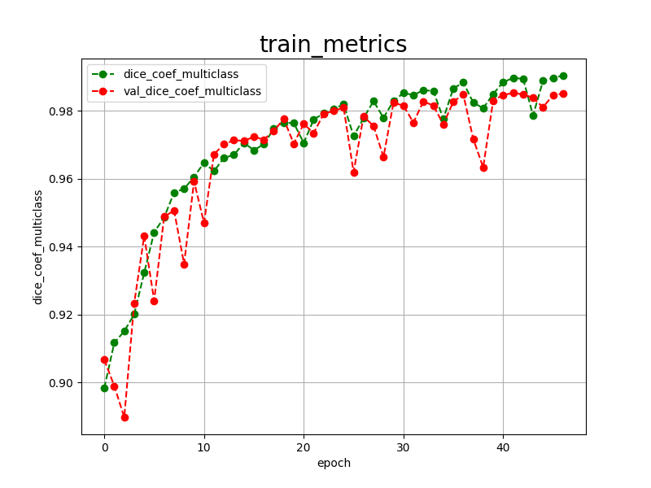 

 
<a href="./projects/TensorFlowFlexUNet/MVTEC-WOOD/eval/train_losses.csv">train_losses.csv</a> 
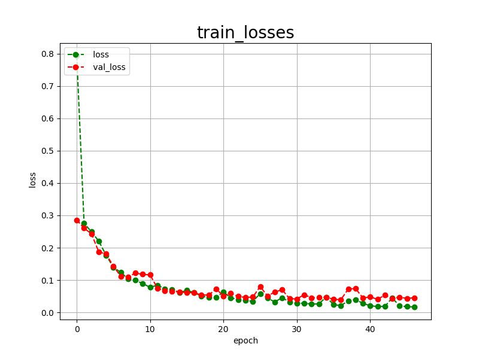 

 

<h3>
4 Evaluation
</h3>
Please move to a <b>./projects/TensorFlowFlexUNet/MVTEC-WOOD</b> folder, 
and run the following bat file to evaluate TensorFlowFlexUNet model for MVTEC-WOOD. 
<pre>
./2.evaluate.bat
</pre>
This bat file simply runs the following command.
<pre>
python ../../../src/TensorFlowFlexUNetEvaluator.py ./train_eval_infer.config
</pre>

Evaluation console output: 
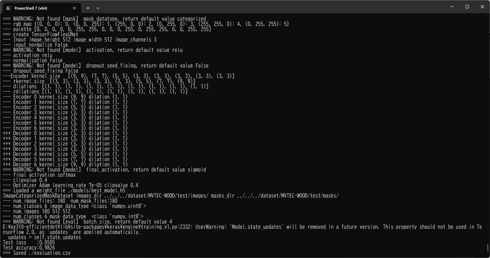
  Image-Segmentation-MVTEC-WOOD

<a href="./projects/TensorFlowFlexUNet/MVTEC-WOOD/evaluation.csv">evaluation.csv</a> 

The loss (categorical_crossentropy) to this MVTEC-WOOD/test was not low, and dice_coef_multiclass not high as shown below.
 
<pre>
categorical_crossentropy,0.0505
dice_coef_multiclass,0.9826
</pre>
 
<h3>
5 Inference
</h3>
Please move to a <b>./projects/TensorFlowFlexUNet/MVTEC-WOOD</b> folder 
,and run the following bat file to infer segmentation regions for images by the Trained-TensorFlowFlexUNet model for MVTEC-WOOD. 
<pre>
./3.infer.bat
</pre>
This simply runs the following command.
<pre>
python ../../../src/TensorFlowFlexUNetInferencer.py ./train_eval_infer.config
</pre>

<b>mini_test_images</b> 
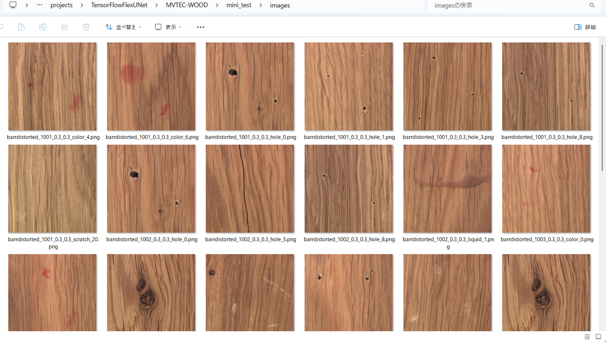 

<b>mini_test_masks(ground_truths)</b> 
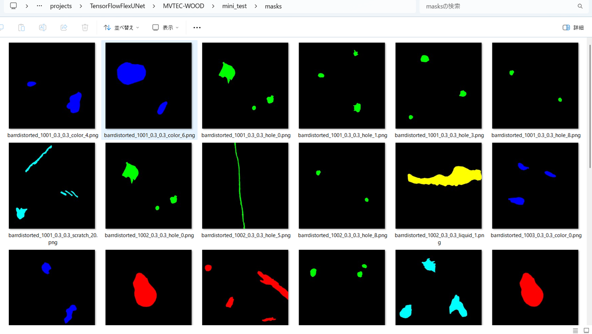 

<b>Inferred test masks</b> 
 
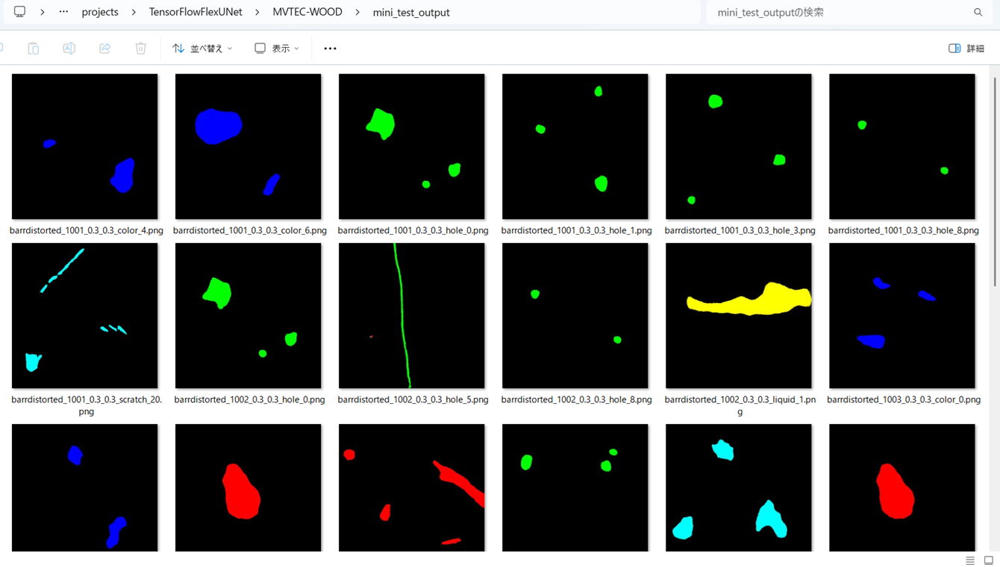 
 

<b>Enlarged images and masks for Images of 512x512 pixels </b> 
<b>rgb_map (color:blue, combined:red, hole:green, liquid:yellow, scratch:cyan)</b>  

<table>
<tr>

<th>Image</th>
<th>Mask (ground_truth)</th>
<th>Inferred-mask</th>
</tr>

<td>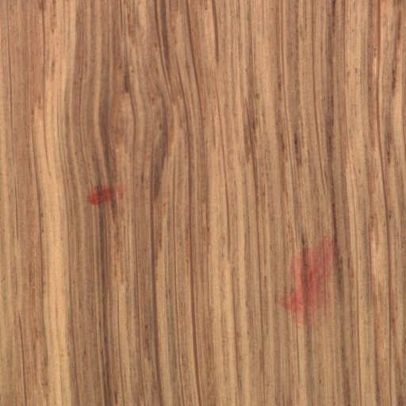</td>
<td></td>
<td></td>
</tr>
<tr>
<td></td>
<td>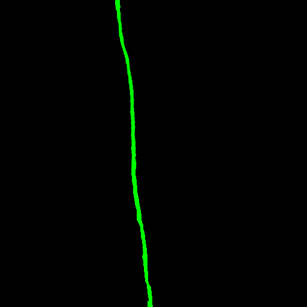</td>
<td>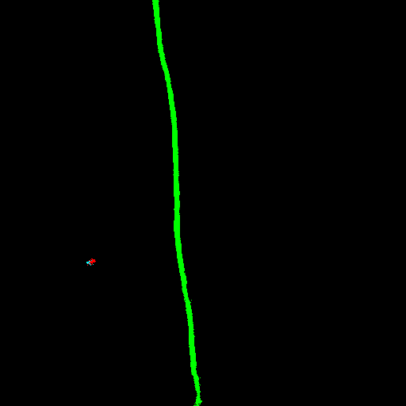</td>
</tr>
<tr>
<td>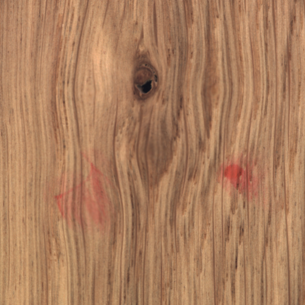</td>
<td>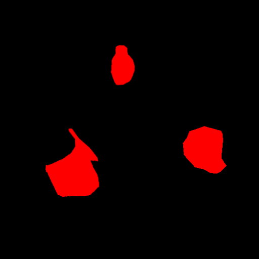</td>
<td>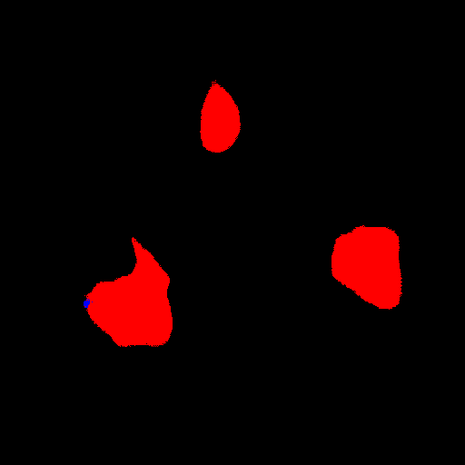</td>
</tr>
<tr>
<td>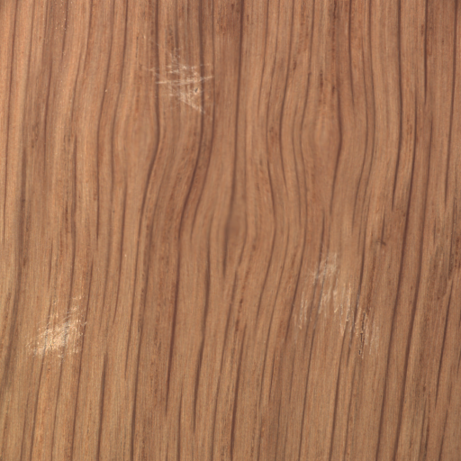</td>
<td></td>
<td>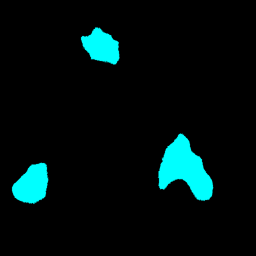</td>
</tr>
<tr>
<td>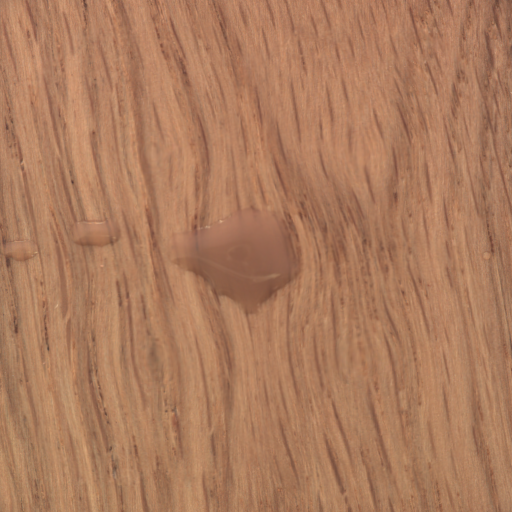</td>
<td>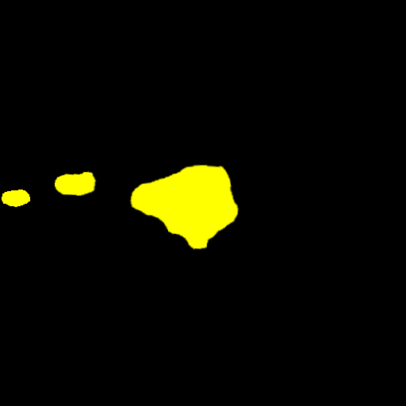</td>
<td></td>
</tr>

<tr>
<td>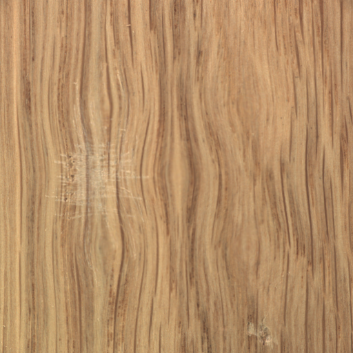</td>
<td>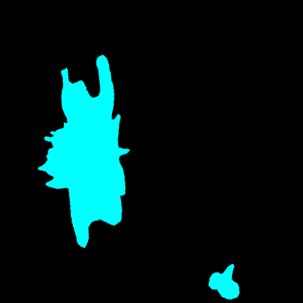</td>
<td>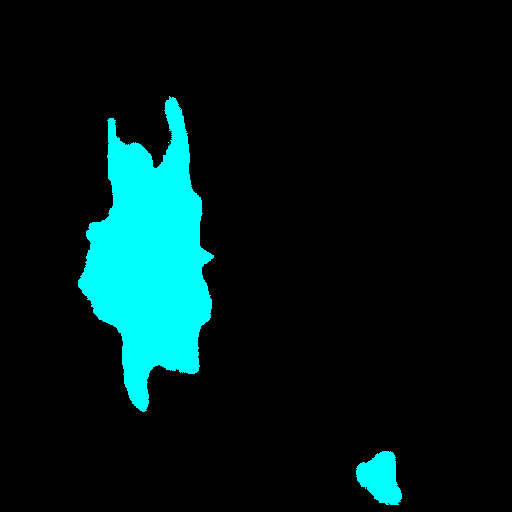</td>
</tr>
</table>

 

<h3>
References
</h3>
<b>1. TensorFlow-FlexUNet-Image-Segmentation-Model</b> 
Toshiyuki Arai antillia.com  
<a href="https://github.com/sarah-antillia/TensorFlow-FlexUNet-Image-Segmentation-Model">
https://github.com/sarah-antillia/TensorFlow-FlexUNet-Image-Segmentation-Model
</a>
 
 
<b>2. TensorFlow-FlexUNet-Image-Segmentation-MVTec-GRID</b> 
Toshiyuki Arai antillia.com  
<a href="https://github.com/atlan-antillia/TensorFlow-FlexUNet-Image-Segmentation-MVTec-GRID">
https://github.com/atlan-antillia/TensorFlow-FlexUNet-Image-Segmentation-MVTec-GRID
</a>
 
 
<b>3. TensorFlow-FlexUNet-Image-Segmentation-MVTec-SCREW</b> 
Toshiyuki Arai antillia.com  
<a href="https://github.com/atlan-antillia/TensorFlow-FlexUNet-Image-Segmentation-MVTec-SCREW">
https://github.com/atlan-antillia/TensorFlow-FlexUNet-Image-Segmentation-MVTec-SCREW
</a>
 
 
<b>4. TensorFlow-FlexUNet-Image-Segmentation-MVTec-TRANSISTOR</b> 
Toshiyuki Arai antillia.com  
<a href="https://github.com/atlan-antillia/TensorFlow-FlexUNet-Image-Segmentation-MVTec-TRANSISTOR">
https://github.com/atlan-antillia/TensorFlow-FlexUNet-Image-Segmentation-MVTec-TRANSISTOR
</a>
 
 
<b>5. TensorFlow-FlexUNet-Image-Segmentation-MVTec-CABLE</b> 
Toshiyuki Arai antillia.com  
<a href="https://github.com/atlan-antillia/TensorFlow-FlexUNet-Image-Segmentation-MVTec-CABLE">
https://github.com/atlan-antillia/TensorFlow-FlexUNet-Image-Segmentation-MVTec-CABLE
</a>
 
 
<b>6. TensorFlow-FlexUNet-Image-Segmentation-MVTec-METAL-NUT</b> 
Toshiyuki Arai antillia.com  
<a href="https://github.com/atlan-antillia/TensorFlow-FlexUNet-Image-Segmentation-MVTec-METAL-NUT">
https://github.com/atlan-antillia/TensorFlow-FlexUNet-Image-Segmentation-MVTec-METAL-NUT
</a>
 
 
<b>7. TensorFlow-FlexUNet-Image-Segmentation-MVTec-TILE</b> 
Toshiyuki Arai antillia.com  
<a href="https://github.com/atlan-antillia/TensorFlow-FlexUNet-Image-Segmentation-MVTec-TILE">
https://github.com/atlan-antillia/TensorFlow-FlexUNet-Image-Segmentation-MVTec-TILE
</a>

